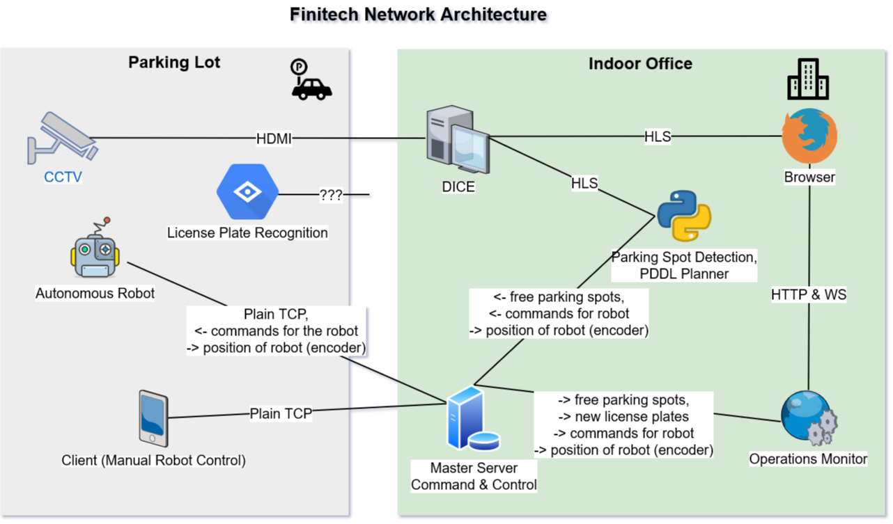

# Finitech Operations Monitor 

## Features
- Autonomous parking solution using an [open-source](https://bitbucket.org/planning-researchers/cloud-solver/src/master/) project, [Solver.Planning.Domains](http://solver.planning.domains/). It is an artificial intelligence system for automated planning, and consists of an initial state, actions, and a goal state. By applying the actions over the initial state and all child states, a goal can be found.
- Thoroughly tested in 10 different scenarios (available under `src/assets/planner-logic/tests/`):
- Live stream from parking lot CCTV cameras
- Closed-loop parking lot real-time visual updates (using camera vision feedback system)
- Live stream from Raspberry Pi cameras onboard the robot (**under consideration**)

## This project is a member of the architecture shown below, which I helped develop as part of [FinitechSDP](https://github.com/Finitech-SDP) (University of Edinburgh project) 2019-2020

## Available Scripts

In the project directory, you can run:

### `npm start`

Runs the app in the development mode. 
Open [http://localhost:3000](http://localhost:3000) to view it in the browser.

The page will reload if you make edits. 
You will also see any lint errors in the console.

### `npm test`

Launches the test runner in the interactive watch mode. 
See the section about [running tests](https://facebook.github.io/create-react-app/docs/running-tests) for more information.

### `npm run build`

Builds the app for production to the `build` folder. 
It correctly bundles React in production mode and optimizes the build for the best performance.

The build is minified and the filenames include the hashes. 
Our app is ready for deployment!

### `npm run deploy`

Deploys the app to our organization's [Github Pages](https://finitech-sdp.github.io/operations-monitor/#/ "Finitech-SDP").

### `sudo sysctl fs.inotify.max_user_watches=524288`

Increases the kernel inotify watch limit
