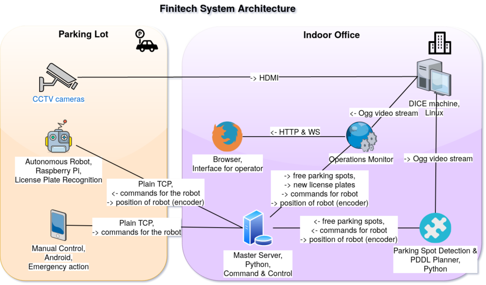

# Finitech Autonomous Parking Environment 
This parking environment is crucial to our system because it provides the ability for our operators to see into the future actions of our robot and to predict and prevent accidents. The environment also offers surveillance solutions, allows for thorough domain testing via the simulator module and for smooth interaction with customers via the public interface module. 

It currently includes support for desktop devices only, over a range of browsers (Chrome, Firefox) and screen sizes (widescreen 16:9, standard 4:3). During development, I managed my tasks using the GitHub Projects Kanban Board feature. The board for this project now contains over 30 stories in column [Done](https://github.com/Finitech-SDP/autonomous-parking-environment/projects/1#column-8191581), with most of them having sub-tasks organized under the form of checklists. This has helped me keep my project tidy and organized, but most importantly it did not let me forget about important bugs that had to be fixed, or about features that I had to work on.

## Simulator
The Scenario Simulator automatically generates PDDL problems given three elements: a current configuration, the location of the robot, and its status. It then forwards this problem to a [back-end](https://github.com/theodor1289/pddl-planner-backend) which I am hosting on my Heroku account. The problem that is generated is intelligently formulated by the simulator to handle special cases like partial solutions which would otherwise crash the solver e.g. when only able to deliver 2/3 cars because of lack of available hubs. Those crashes occurred before I added this optimization because PDDL solvers are still immature: they mostly only ever are released at international planning competitions like the IPC.

The Simulator’s main functionality is to edit, save and reset map configurations (including adding, removing and changing the status of cars). This allows our (future) testing team to plan for new situations, debug errors in existing ones, and easily develop future expansions to our planning domain. Its secondary functionality allows it to perform live re-planning scenarios where cars can be retrieved, requested or parked at a hub in the middle of a simulation, and the robot stops and re-plans accordingly.

It also features 6 built-in test configurations (available under `src/assets/planner/tests.js`) meant to test the planning ability and the efficiency and accuracy of our robot. Those tests allowed me to identify several critical bugs in the planning domain which have now been fixed, and are also useful for finding regression bugs when planning future expansions of the domain.

## Monitor
The Monitor was designed to handle the actual dashboard-server connection via Websockets. Parking lot real-time visual updates were to be provided through this for operators and receptionists to more efficiently manage the parking spaces and communicate essential information and statistics to whoever needed it e.g. clients booking ahead.

Just like the Simulator, the Monitor benefits from fast rendering logic using advanced features of React (PureComponents and memoized stateless functional components) and of the Konva graphics library (FastLayers), and also from various settings designed for the convenience of the user e.g. the ability to switch between global robot plan view and local robot plan view.

Both the Monitor and the Simulator have interactive panels which were designed to function as event alert systems for when someone requests their car at a hub, retrieves their car from a hub, or just drives into a hub. They also feature robot activity logging for general events (lifted a car, parked a car etc.) and always display the number of parking spaces available and the status of the robot. This is for operators or receptionists to be able to forward this information when needed.

## Surveillance
This is the module that provides access to the operator to every available surveillance camera on the premises. It works with local ogg video streaming captured in iframes, and currently only features Appleton Tower Level 3 Demo Room. In order for this to work, one would have to open a stream as instructed by my teammates on one of the computers on level 3 which are connected to the overhead cameras.

## Parking Hub Client Interface
This last module is designed to be used by customers when interacting with our system and physically leaving their car to be stored in our parking lot. The pricing scheme on the website I designed by myself as an initial prototype, and is susceptible to change after consultations with the entire team. Customers are ultimately forwarded to a checkout form available [here](https://finitech-sdp.github.io/autonomous-parking-environment/#/public-interface/checkout), but this form is not able to process any information yet, it is also only a prototype.

## This project is a member of the architecture shown below, which I helped develop as part of [FinitechSDP](https://github.com/Finitech-SDP) (University of Edinburgh project) 2019-2020

## Available Scripts

In the project directory, you can run:

### `npm start`

Runs the app in the development mode. 
Open [http://localhost:3000](http://localhost:3000) to view it in the browser.

The page will reload if you make edits. 
You will also see any lint errors in the console.

### `npm test`

Launches the test runner in the interactive watch mode. 
See the section about [running tests](https://facebook.github.io/create-react-app/docs/running-tests) for more information.

### `npm run build`

Builds the app for production to the `build` folder. 
It correctly bundles React in production mode and optimizes the build for the best performance.

The build is minified and the filenames include the hashes. 
Our app is ready for deployment!

### `npm run deploy`

Deploys the app to our organization's [Github Pages](https://finitech-sdp.github.io/operations-monitor/#/ "Finitech-SDP").

### `sudo sysctl fs.inotify.max_user_watches=524288`

Increases the kernel inotify watch limit
